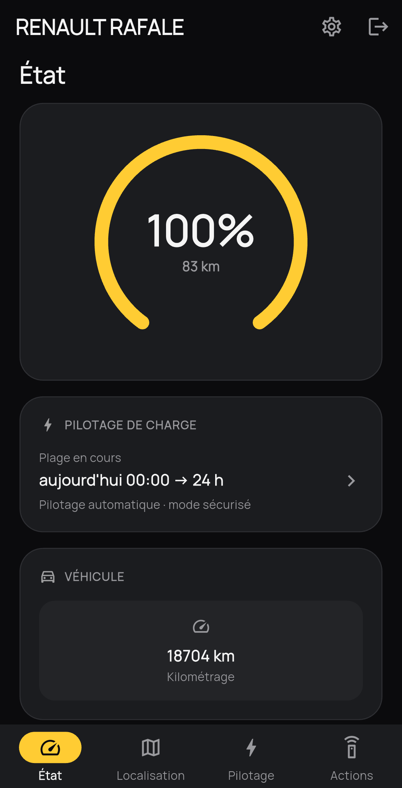
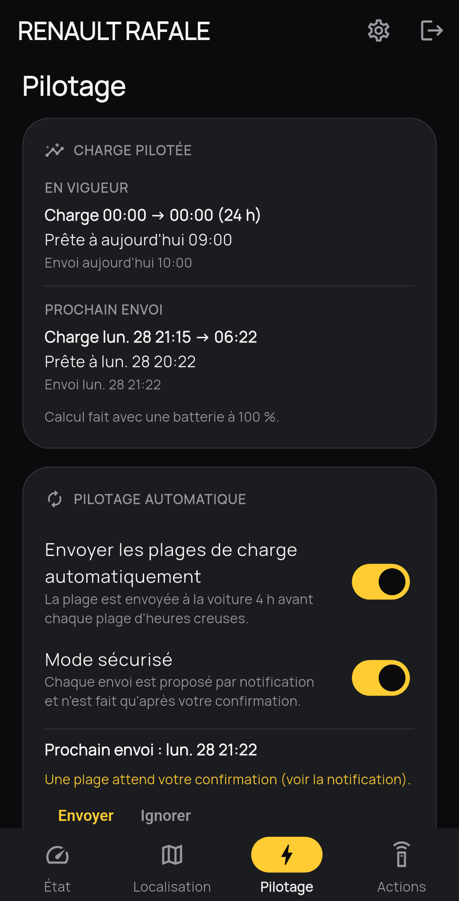
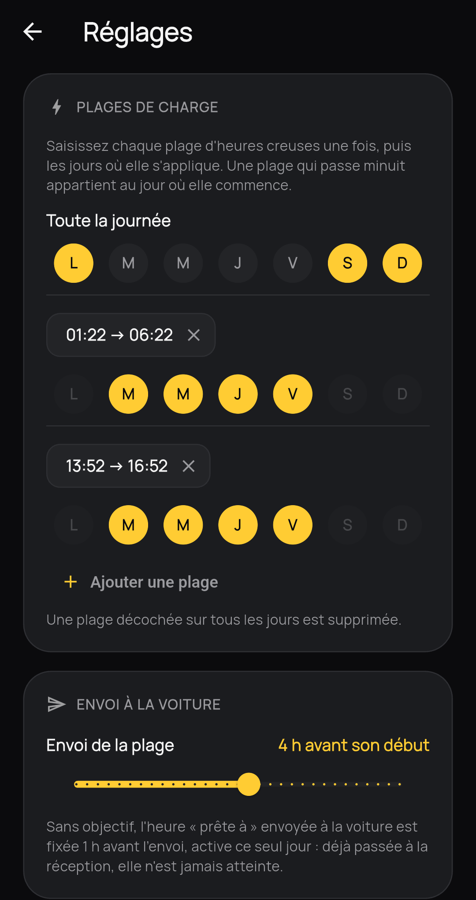
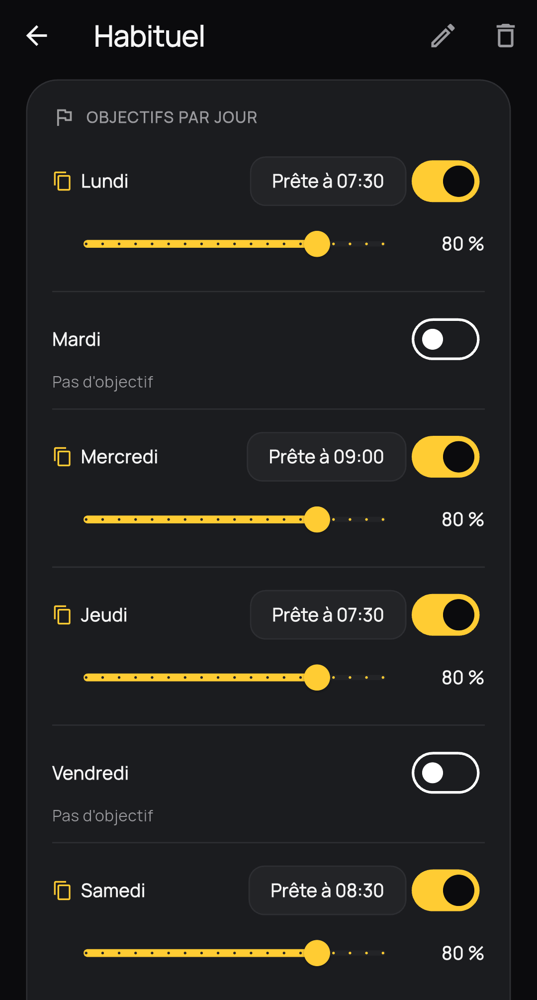
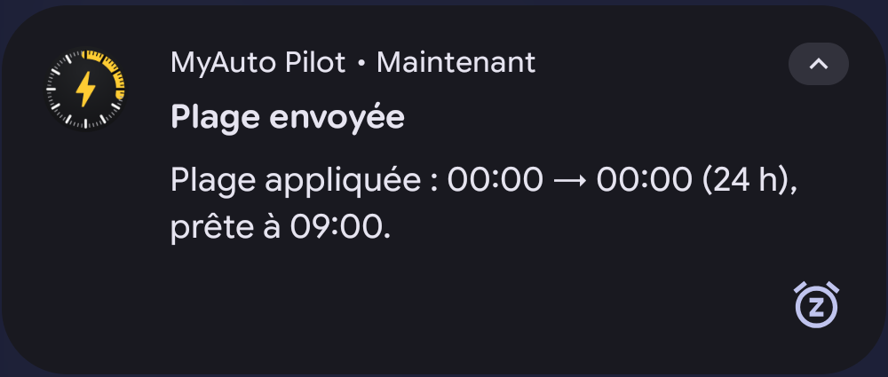

# MyAuto Pilot

**Pilotage de la charge à domicile pour les véhicules électriques Renault,
aligné sur vos vraies heures creuses.** Application Android indépendante et
non officielle.

> **English summary** — MyAuto Pilot is an unofficial Android app for Renault
> EV owners. MyRenault only allows a single, fixed charging window: MyAuto
> Pilot lets you define several off-peak windows per weekday and "ready by"
> targets (e.g. 80 % on Monday at 7:30), then writes the right window to the
> car shortly before each off-peak period. Not affiliated with Renault; uses
> the undocumented MyRenault API. French UI only for now.

## Pourquoi

L'application MyRenault ne propose qu'**une seule plage de charge**,
identique tous les jours. Or beaucoup de contrats heures creuses ont
plusieurs plages par jour, ou des journées entières en heures creuses.
MyAuto Pilot garde votre vrai calendrier dans le téléphone et envoie à la
voiture, avant chaque plage, la plage de charge qui convient.

## Fonctionnalités

- **Plages d'heures creuses par jour de la semaine**, saisies une fois avec
  les jours concernés, et journées entièrement en heures creuses.
- **Objectifs « prête à X % à telle heure »** : agendas récurrents
  (« Habituel », « Vacances »…) et objectif exceptionnel (« demain 7 h à
  100 % »). Si une plage ne suffit pas, elle est élargie juste ce qu'il faut.
- **Envoi automatique** de la plage à la voiture avant son début (délai
  réglable), à l'heure exacte, même application fermée.
- **Mode sécurisé** (activé par défaut) : chaque envoi vous est proposé par
  notification et n'est fait qu'après votre confirmation.
- Tableau de bord : batterie, autonomie, position, climatisation et charge
  à distance.

## Aperçu

  
  
  
  

  

## Installation

1. Téléchargez l'APK de la dernière version dans les
   [Releases](https://github.com/UlricGenievre/myauto-pilot/releases).
2. Installez-le (Android vous demandera d'autoriser l'installation depuis
   cette source).
3. Pour recevoir les mises à jour, vous pouvez suivre ce dépôt avec
   [Obtainium](https://github.com/ImranR98/Obtainium).

Au premier lancement : lisez l'avertissement, choisissez le **pays** de
votre compte MyRenault, connectez-vous, puis renseignez vos plages dans
**Réglages** (roue dentée).

**Autorisations demandées** : notifications (confirmations et résultats des
envois), « Alarmes et rappels » (envoi des plages à l'heure exacte, à
autoriser dans le réglage Android que l'application ouvre à l'activation du
pilotage), démarrage automatique (reprogrammation après un redémarrage du
téléphone).

## Compatibilité

Le pilotage n'est possible que sur les modèles dont l'accès aux réglages de
charge est connu. Les autres restent consultables en **lecture seule**.

| Niveau | Modèles | Pilotage |
|---|---|---|
| Vérifié | Rafale (`XHN1CP`) | complet |
| Compatible, non vérifié | Renault 5 E-Tech, Renault 4 E-Tech, Alpine A290, Master E-Tech, `XCB1SE` | mode sécurisé imposé |
| Autres | Zoé, Mégane, Spring… | lecture seule |

Votre voiture est « compatible, non vérifiée » et tout fonctionne ?
[Ouvrez une issue « Modèle de véhicule »](https://github.com/UlricGenievre/myauto-pilot/issues/new/choose)
pour qu'elle passe en « vérifié ». Le code modèle s'affiche dans l'onglet
Pilotage.

## Confidentialité

- Vos **identifiants MyRenault ne sont jamais enregistrés** : ils servent
  une fois à ouvrir la session, dont seul le jeton est conservé, chiffré,
  sur le téléphone.
- Votre paramétrage reste **sur votre téléphone**. Il n'y a aucun serveur
  MyAuto Pilot, aucune statistique, aucune publicité.
- L'application ne communique qu'avec :
  - les **serveurs Renault** (données et réglages du véhicule) ;
  - **GitHub** (clés d'accès publiées par le projet
    [renault-api](https://github.com/hacf-fr/renault-api)) ;
  - **OpenStreetMap** (fonds de carte de l'onglet Localisation).

Détail : [politique de confidentialité](PRIVACY.md).

## Avertissement

MyAuto Pilot n'est **ni affiliée à Renault ni approuvée par Renault**.
« Renault », « MyRenault » et les noms de modèles sont des marques de leurs
propriétaires, cités uniquement pour indiquer la compatibilité.
L'application utilise l'accès **non documenté** de MyRenault, que Renault
peut modifier ou couper à tout moment. Elle **modifie les réglages de
charge** de votre véhicule : vérifiez son comportement, gardez le mode
sécurisé tant que vous n'avez pas confiance. Logiciel fourni **sans aucune
garantie** : vous l'utilisez à vos risques.

## Remerciements

L'accès aux services Renault s'appuie sur le travail de la communauté
[hacf-fr/renault-api](https://github.com/hacf-fr/renault-api).

## Contribuer

Signalements et propositions bienvenus via les issues. Pour compiler
l'application : [docs/DEVELOPMENT.md](docs/DEVELOPMENT.md).

## Licence

[GPL-3.0](LICENSE) : vous pouvez utiliser, étudier, modifier et redistribuer
l'application, à condition que toute version distribuée reste sous la même
licence, avec son code source.
